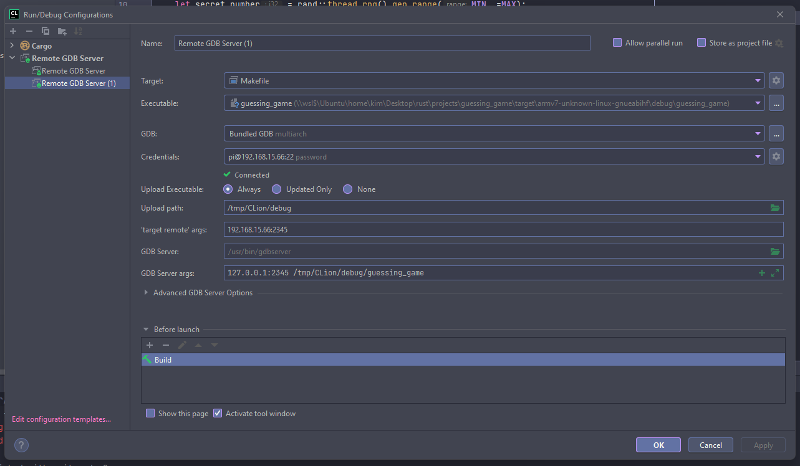

# guessing_game

A simple (automated) guessing game, written in Rust, adapted from
[The Book](https://doc.rust-lang.org/book/ch02-00-guessing-game-tutorial.html).

This example has instructions on how to debug Rust code remotely on ARMv7 targets, using
`gdbserver`.

## Pre-requisites

- [Git](https://git-scm.com/)
- [Rust](https://www.rust-lang.org/tools/install)
- [CLion](https://www.jetbrains.com/clion/)
  - [intellij-rust](https://www.jetbrains.com/rust/)
- [Visual Studio Code](https://code.visualstudio.com/) or
  - [rust-analyzer](https://marketplace.visualstudio.com/items?itemName=matklad.rust-analyzer)
- [gdbserver](https://sourceware.org/gdb/onlinedocs/gdb/Server.html) installed on the target

## Cross-compilation

A very comprehensive guide on cross-compilation of Rust programs can be found on
[rust-cross](https://github.com/japaric/rust-cross).

Be sure to follow the instructions in order to be able to compile this program to your desired
target. In this repository, an ARMv7 Raspberry Pi is used as an example.

### CLion

On CLion, we need to create a simple `Makefile` in order to define
[custom build targets](https://www.jetbrains.com/help/clion/custom-build-targets.html):

```Makefile
# Makefile

all:
	cargo build --target=armv7-unknown-linux-gnueabihf

clean:
	rm -rf target/armv7-unknown-linux-gnueabihf
```


### VSCode

On VSCode, we reuse the previously mentioned `Makefile` within the `rust: cargo build ARMv7` task:

```jsonc
// .vscode/tasks.json

{
  "version": "2.0.0",
  "tasks": [
    // ...
    {
      "label": "rust: cargo build ARMv7",
      "command": "make",
      "args": ["all"],
      "problemMatcher": ["$rustc"],
      "group": "build",
    }
    // ...
  ]
}
```

## Remote debugging

In order to debug the cross-compiled binary remotely, we need to perform the following steps:

1. Copy the binary to the target, in this example, through `scp`
2. Launch the `gdbserver` on the target
3. Connect to the target `gdbserver` using either `lldb` (VSCode) or `gdb-multiarch` (CLion)

### CLion

> Apparentely, as of CLion 2021.2.2, remote debugging on ARM (and possibly other) platforms requires
> the following configuration to be made:
>
> Disable `Break on panic` option in `Preferences | Build, Execution, Deployment | Debugger`
>
> Reference: https://github.com/intellij-rust/intellij-rust/issues/7916

On CLion, we create a
[`Remote GDB Server` configuration](https://www.jetbrains.com/help/clion/remote-gdb-server.html)
that automatically takes care of everything:




Then to debug, select the newly created `Remote GDB Server` configuration and press the "bug" symbol
(*Shift + F9*).


### VSCode

On VSCode, this is done via the `Remote debug 'guessing_game'` launch configuration, and its
associated task `rust: remote ARMv7 debug setup`:

```jsonc
// .vscode/launch.json

{
  "version": "0.2.0",
  "configurations": [
    {
      "type": "lldb",
      "request": "custom",
      "name": "Remote debug 'guessing_game'",
      "preLaunchTask": "rust: remote ARMv7 debug setup",
      "targetCreateCommands": [
        "target create ${workspaceFolder}/target/armv7-unknown-linux-gnueabihf/debug/guessing_game"
      ],
      "processCreateCommands": ["gdb-remote 192.168.15.66:2345"]
    }
    // ...
  ]
}
```

```jsonc
// .vscode/tasks.json

{
  "version": "2.0.0",
  "tasks": [
    {
      "label": "rust: remote ARMv7 debug setup",
      "type": "shell",
      "command": "${workspaceFolder}/scripts/remote_debug.sh",
      "args": ["${workspaceFolder}", "192.168.15.66", "2345"],
      "group": "none",
      "dependsOn": ["rust: cargo build ARMv7"],
    },
    {
      "label": "rust: cargo build ARMv7",
      "command": "make",
      "args": ["all"],
      "problemMatcher": ["$rustc"],
      "group": "build",
    }
    // ...
  ]
}
```

Notice how the `rust: remote ARMv7 debug setup` task is calling `scripts/remote_debug.sh`, which is
programatically doing all of the 3 steps mentioned above.

Then to debug, simply select the `Remote debug 'guessing_game'` launch configuration and press
(*F5*).


